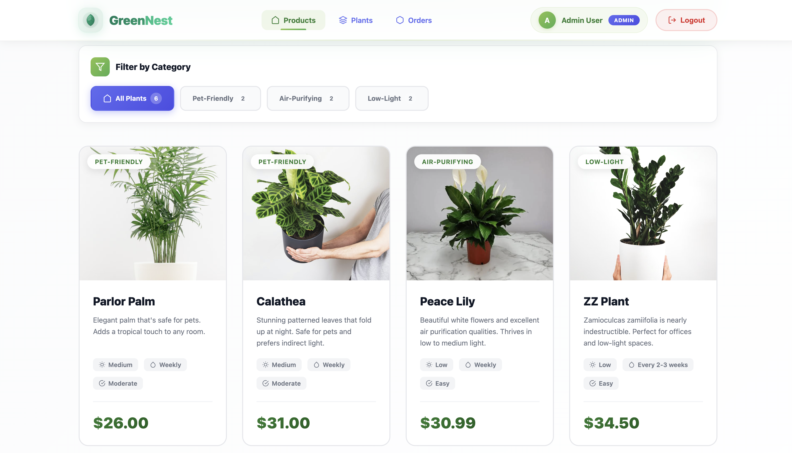

<div align="center">
  

  # 🌱 GreenNest

  ### *Your Premium Online Plant Shop*

  [](https://www.mongodb.com/)
  [](https://expressjs.com/)
  [](https://reactjs.org/)
  [](https://nodejs.org/)
  [](https://redux.js.org/)
  [](https://jwt.io/)

  <p align="center">
    A modern, full-stack e-commerce platform for plant enthusiasts
    <br />
    <a href="#features"><strong>Explore Features »</strong></a>
    <br />
    <br />
    <a href="#installation">Installation</a>
    ·
    <a href="#api-documentation">API Docs</a>
  </p>
</div>

---

## 📋 Table of Contents

- [About The Project](#about-the-project)
- [Features](#features)
- [Tech Stack](#tech-stack)
- [Screenshots](#screenshots)
- [Getting Started](#getting-started)
- [Installation](#installation)
- [Environment Variables](#environment-variables)
- [API Documentation](#api-documentation)
- [Project Structure](#project-structure)
- [Usage](#usage)
- [Default Credentials](#default-credentials)
- [Roadmap](#roadmap)
- [Contributing](#contributing)
- [License](#license)
- [Contact](#contact)

---

## 🌱 About The Project

**GreenNest** is a premium full-stack e-commerce application designed for plant lovers. Built with the MERN stack (MongoDB, Express.js, React, Node.js), it offers a seamless shopping experience with modern UI/UX design, comprehensive admin controls, and secure payment processing.

### Why GreenNest?

- 🎨 **Ultra-Modern Design**: Beautiful, responsive UI with smooth animations and gradients
- 🔐 **Secure Authentication**: JWT-based authentication with role-based access control
- 📦 **Complete Order Management**: Track orders from placement to delivery
- 🛡️ **Admin Dashboard**: Comprehensive inventory and order management
- 🌍 **Real-time Updates**: Redux state management for instant UI updates
- 💳 **Cash on Delivery**: Simple and secure payment option

---

## ✨ Features

### 🛍️ Customer Features

- **Browse & Search**: Explore curated plant collections with category filters
- **Product Details**: Detailed plant information including care instructions
- **Shopping Cart**: Add, remove, and manage items before checkout
- **User Authentication**: Secure registration and login system
- **Order Placement**: Easy checkout process with shipping address
- **Order Tracking**: View order history and track delivery status
- **Responsive Design**: Optimized for all devices (mobile, tablet, desktop)

### 👨‍💼 Admin Features

- **Dashboard Analytics**: View total plants, inventory value, and stock alerts
- **Plant Management**: Create, read, update, and delete (CRUD) operations
- **Order Management**: View all orders and update order status
- **User Management**: View registered users
- **Stock Monitoring**: Low stock alerts for inventory management
- **Real-time Updates**: Instant UI updates when managing inventory

### 🎯 Key Highlights

- **Modern UI/UX**: Glassmorphism effects, gradient backgrounds, smooth animations
- **Role-Based Access**: Separate interfaces for customers and administrators
- **State Management**: Redux Toolkit for efficient state handling
- **Protected Routes**: Secure pages requiring authentication
- **Error Handling**: Comprehensive error messages and user feedback
- **Professional Forms**: Beautiful input fields with validation

---

## 🛠️ Tech Stack

### Frontend

- **React 18** - UI library
- **Vite** - Build tool and dev server
- **Redux Toolkit** - State management
- **React Router v6** - Client-side routing
- **Axios** - HTTP client
- **CSS3** - Styling with modern effects

### Backend

- **Node.js** - Runtime environment
- **Express.js** - Web framework
- **MongoDB** - NoSQL database
- **Mongoose** - MongoDB ODM
- **JWT** - Authentication tokens
- **bcrypt** - Password hashing
- **dotenv** - Environment variables

---

## 📸 Screenshots





---

## 🚀 Getting Started

Follow these instructions to get GreenNest running on your local machine.

### Prerequisites

- **Node.js** (v16 or higher)
- **MongoDB** (v5.0 or higher)
- **npm** or **yarn**

### Installation

1. **Clone the repository**
   ```bash
   git clone https://github.com/yourusername/GreenNest.git
   cd GreenNest
   ```

2. **Install Frontend Dependencies**
   ```bash
   npm install
   ```

3. **Install Backend Dependencies**
   ```bash
   cd backend
   npm install
   cd ..
   ```

4. **Set up MongoDB**
   - Make sure MongoDB is running on `localhost:27017`
   - Or use MongoDB Atlas cloud database

5. **Configure Environment Variables**

   Create `.env` file in the `backend/` directory:
   ```env
   PORT=5000
   MONGODB_URI=mongodb://localhost:27017/greennest
   JWT_SECRET=your_super_secret_jwt_key_change_this
   NODE_ENV=development
   ```

6. **Seed the Database** (Optional)
   ```bash
   cd backend
   npm run seed
   ```

7. **Start the Application**

   **Terminal 1 - Backend:**
   ```bash
   cd backend
   npm start
   ```

   **Terminal 2 - Frontend:**
   ```bash
   npm run dev
   ```

8. **Open your browser**
   - Frontend: `http://localhost:5173`
   - Backend: `http://localhost:5000`

---

## 🔐 Environment Variables

### Backend (.env)

| Variable | Description | Example |
|----------|-------------|---------|
| `PORT` | Backend server port | `5000` |
| `MONGODB_URI` | MongoDB connection string | `mongodb://localhost:27017/greennest` |
| `JWT_SECRET` | Secret key for JWT tokens | `your_secret_key` |
| `NODE_ENV` | Environment mode | `development` or `production` |

---

## 📚 API Documentation

### Base URL
```
http://localhost:5000/api
```

### Authentication Endpoints

#### Register User
```http
POST /auth/register
Content-Type: application/json

{
  "name": "John Doe",
  "email": "john@example.com",
  "password": "password123"
}
```

#### Login User
```http
POST /auth/login
Content-Type: application/json

{
  "email": "john@example.com",
  "password": "password123"
}
```

**Response:**
```json
{
  "success": true,
  "data": {
    "_id": "...",
    "name": "John Doe",
    "email": "john@example.com",
    "role": "user",
    "token": "eyJhbGciOiJIUzI1NiIsInR5cCI6IkpXVCJ9..."
  }
}
```

### Plants Endpoints

#### Get All Plants
```http
GET /plants
```

#### Get Single Plant
```http
GET /plants/:id
```

#### Create Plant (Admin Only)
```http
POST /plants
Authorization: Bearer <token>
Content-Type: application/json

{
  "id": "monstera-deliciosa",
  "name": "Monstera Deliciosa",
  "description": "Beautiful tropical plant...",
  "price": 45.99,
  "category": "Tropical",
  "image": "/images/monstera.jpg",
  "stock": 12,
  "careLevel": "Moderate",
  "lightRequirement": "Medium",
  "wateringFrequency": "Weekly"
}
```

#### Update Plant (Admin Only)
```http
PUT /plants/:id
Authorization: Bearer <token>
```

#### Delete Plant (Admin Only)
```http
DELETE /plants/:id
Authorization: Bearer <token>
```

### Orders Endpoints

#### Create Order
```http
POST /orders
Authorization: Bearer <token>
Content-Type: application/json

{
  "items": [
    {
      "plant": "peace-lily",
      "quantity": 2
    }
  ],
  "shippingAddress": {
    "street": "123 Main St",
    "city": "New York",
    "state": "NY",
    "zipCode": "10001",
    "country": "USA"
  },
  "paymentMethod": "cash"
}
```

#### Get My Orders
```http
GET /orders/my-orders
Authorization: Bearer <token>
```

#### Get All Orders (Admin Only)
```http
GET /orders
Authorization: Bearer <token>
```

#### Get Order by ID
```http
GET /orders/:id
Authorization: Bearer <token>
```

#### Update Order Status (Admin Only)
```http
PUT /orders/:id/status
Authorization: Bearer <token>
Content-Type: application/json

{
  "status": "delivered"
}
```

**Order Statuses:**
- `pending` - Order placed, awaiting processing
- `processing` - Order is being prepared
- `shipped` - Order has been shipped
- `delivered` - Order delivered successfully
- `cancelled` - Order cancelled

---

## 📁 Project Structure

```
GreenNest/
├── backend/
│   ├── src/
│   │   ├── config/
│   │   │   └── db.js              # Database connection
│   │   ├── controllers/
│   │   │   ├── authController.js   # Authentication logic
│   │   │   ├── plantController.js  # Plant CRUD operations
│   │   │   └── orderController.js  # Order management
│   │   ├── middleware/
│   │   │   └── auth.js            # JWT authentication middleware
│   │   ├── models/
│   │   │   ├── User.js            # User schema
│   │   │   ├── Plant.js           # Plant schema
│   │   │   └── Order.js           # Order schema
│   │   ├── routes/
│   │   │   ├── authRoutes.js      # Auth endpoints
│   │   │   ├── plantRoutes.js     # Plant endpoints
│   │   │   └── orderRoutes.js     # Order endpoints
│   │   └── server.js              # Express server setup
│   ├── .env                       # Environment variables
│   └── package.json
│
├── src/
│   ├── components/
│   │   ├── Header.jsx             # Navigation bar
│   │   └── ProtectedRoute.jsx    # Route protection
│   ├── features/
│   │   ├── auth/
│   │   │   └── authSlice.js       # Auth state management
│   │   ├── cart/
│   │   │   └── cartSlice.js       # Shopping cart state
│   │   ├── orders/
│   │   │   └── ordersSlice.js     # Orders state
│   │   └── plants/
│   │       └── plantsSlice.js     # Plants state
│   ├── pages/
│   │   ├── Landing.jsx            # Home page
│   │   ├── Products.jsx           # Product catalog
│   │   ├── Cart.jsx               # Shopping cart
│   │   ├── Checkout.jsx           # Checkout page
│   │   ├── MyOrders.jsx           # Customer orders
│   │   ├── OrderDetails.jsx       # Order details view
│   │   ├── Admin.jsx              # Admin dashboard
│   │   ├── AdminOrders.jsx        # Admin order management
│   │   ├── Login.jsx              # Login page
│   │   └── Register.jsx           # Registration page
│   ├── store.js                   # Redux store configuration
│   ├── App.jsx                    # Main app component
│   └── main.jsx                   # App entry point
│
├── public/
│   ├── favicon.svg                # App icon
│   └── images/                    # Plant images
│
├── doc/
│   ├── logo.svg                   # Project logo
│   └── screenshots/               # Application screenshots
│
└── README.md
```

---

## 💻 Usage

### For Customers

1. **Browse Plants**: Navigate to the Products page
2. **Add to Cart**: Click "Add to Cart" on desired plants
3. **View Cart**: Check items and quantities
4. **Checkout**: Fill in shipping address and place order
5. **Track Orders**: View order status in "My Orders"

### For Administrators

1. **Login as Admin**: Use admin credentials
2. **Manage Plants**: Add, edit, or delete plant listings
3. **Monitor Inventory**: Check stock levels and alerts
4. **Process Orders**: View and update order statuses
5. **View Analytics**: Check dashboard statistics

---

## 🔑 Default Credentials

### Admin Account
```
Email: admin@greennest.com
Password: admin123
```

### Test User Account
```
Email: user@greennest.com
Password: user123
```

> ⚠️ **Security Note**: Change these credentials in production!

---

## 🗺️ Roadmap

- [x] User Authentication & Authorization
- [x] Product Catalog & Search
- [x] Shopping Cart Functionality
- [x] Order Management System
- [x] Admin Dashboard
- [ ] Payment Gateway Integration (Stripe/PayPal)
- [ ] Email Notifications
- [ ] Product Reviews & Ratings
- [ ] Wishlist Feature
- [ ] Advanced Search & Filters
- [ ] Multiple Plant Images
- [ ] Plant Care Reminders
- [ ] Mobile App (React Native)

---

## 🤝 Contributing

Contributions are what make the open-source community amazing! Any contributions you make are **greatly appreciated**.

1. Fork the Project
2. Create your Feature Branch (`git checkout -b feature/AmazingFeature`)
3. Commit your Changes (`git commit -m 'Add some AmazingFeature'`)
4. Push to the Branch (`git push origin feature/AmazingFeature`)
5. Open a Pull Request

---

## 📄 License

Distributed under the MIT License. See `LICENSE` for more information.

---

## 📞 Contact

**Zakaria Sabiri**

- Email: zaksab98@gmail.com
- GitHub: [@zaka41a](https://github.com/zaka41a)
- 
---

## 🙏 Acknowledgments

- [React Documentation](https://reactjs.org/)
- [MongoDB Documentation](https://docs.mongodb.com/)
- [Express.js Guide](https://expressjs.com/)
- [Redux Toolkit](https://redux-toolkit.js.org/)
- [Font Awesome Icons](https://fontawesome.com/)
- [Unsplash](https://unsplash.com/) for plant images

---

<div align="center">

  ### Made with ❤️ by Zaka41a

  ⭐ Star this repo if you found it helpful!

</div>
